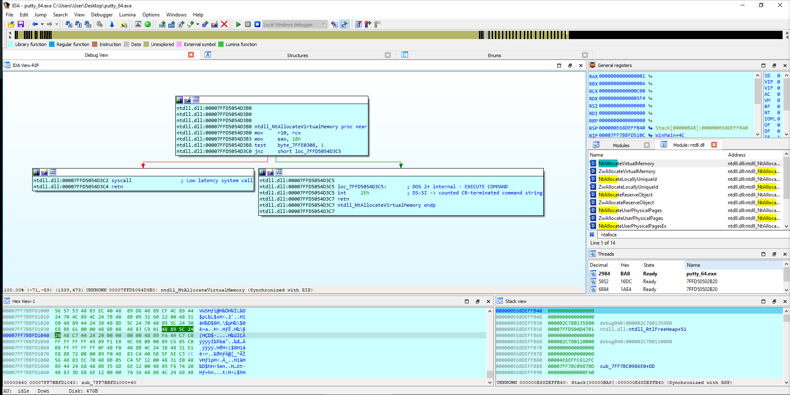

# SYSCALL_API

`syscall_api.asm` block is used for dynamically finding the syscall number (SN) inside a function body and performing a manual syscall with the found SN. If SN could not be found inside the given function body, `R10` register will be equal to `-1`. Check [here](./example/) for example code. 

Block searches for the following common instruction sequence during syscalls.
```nasm
    mov r10, rcx
    mov eax, ??? ; <-- two byte SN here
    ; ...
    syscall
    ret
```




## Prior Work & References 
* https://conference.hitb.org/hitbsecconf2023ams/session/windows-syscalls-in-shellcode-advanced-techniques-for-malicious-functionality/
* https://github.com/klezVirus/SysWhispers3
* https://github.com/jthuraisamy/SysWhispers2
* https://github.com/jthuraisamy/SysWhispers
* https://klezvirus.github.io/RedTeaming/AV_Evasion/NoSysWhisper/
* https://outflank.nl/blog/2019/06/19/red-team-tactics-combining-direct-system-calls-and-srdi-to-bypass-av-edr/